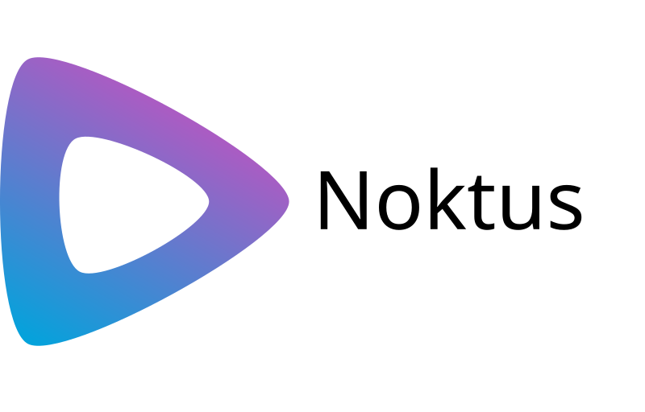

    

<picture></picture>

# Overview

Noktus is an unofficial cross-platform desktop client for Jellyfin that combines
the official Jellyfin Web interface with optional native MPV playback.

Rather than replacing Jellyfin with another frontend, Noktus focuses on
providing a polished desktop experience while staying as close as possible to
the official Jellyfin interface. Libraries, authentication, settings, and
playback behavior continue to be driven by Jellyfin, allowing new server
features and UI improvements to flow naturally without maintaining a separate
frontend.

## Design goals

Noktus is intentionally lightweight.

Instead of reimplementing Jellyfin or building a complete media player from
scratch, Noktus focuses on providing a reliable desktop runtime around the
official Jellyfin experience.

The project aims to:

- Stay close to upstream Jellyfin.
- Minimize platform-specific behavior.
- Keep long-term maintenance manageable.
- Provide native desktop integration where it improves the experience.
- Use MPV where it offers a better playback experience.

## How Noktus works

Noktus loads the official Jellyfin Web interface directly.

For most content, playback works exactly as it does in a browser using the
standard Jellyfin web player. Libraries, accounts, queues, authentication, and
playback remain owned by Jellyfin.

For videos that benefit from native playback, Noktus can instead launch an
external MPV window while keeping playback synchronized with Jellyfin.
Progress, pause state, resume position, and other playback events continue to
be reported back to the server.

On Windows, [mpv.net](https://github.com/mpvnet-player/mpv.net) can also be
used as a drop-in replacement for MPV. Noktus automatically detects MPV first,
then mpv.net, or either executable can be selected manually in Settings.

## Native MPV integration

When MPV is used, Noktus adds desktop-focused features while remaining fully
integrated with Jellyfin.

- Native Skip Intro and Skip Outro prompts.
- Playback reporting.
- Resume position synchronization.
- Automatic MPV detection.
- Optional mpv.net support on Windows.

Skip Intro and Skip Outro prompts are powered by Jellyfin's authenticated
MediaSegments API, making them compatible with servers using Intro Skipper and
other supported segment providers without requiring additional configuration.

## Playback

MPV is completely optional.

The built-in Jellyfin player remains available for content such as Live TV,
music, active recordings, SyncPlay, or any scenario where the standard web
player is the better choice.

Users are free to choose whichever playback method best fits the content.

## Platform

Noktus uses a bundled Chromium runtime to provide consistent behavior across
Windows, macOS, and Linux. This keeps the desktop experience predictable while
avoiding platform-specific differences between system webviews.

## LLM Disclosure

The core of the codebase was written by me. I used a local LLM as a development
aid for tasks such as debugging, documentation and grammar reviews, researching
topics I was rusty on, and generating portions of the test suite (because,
let's be honest, nobody enjoys writing tests).

All architecture, design decisions, implementation, and final code review were
performed by me. Any LLM-generated suggestions were reviewed, modified where
necessary, and verified before being incorporated into the project.
